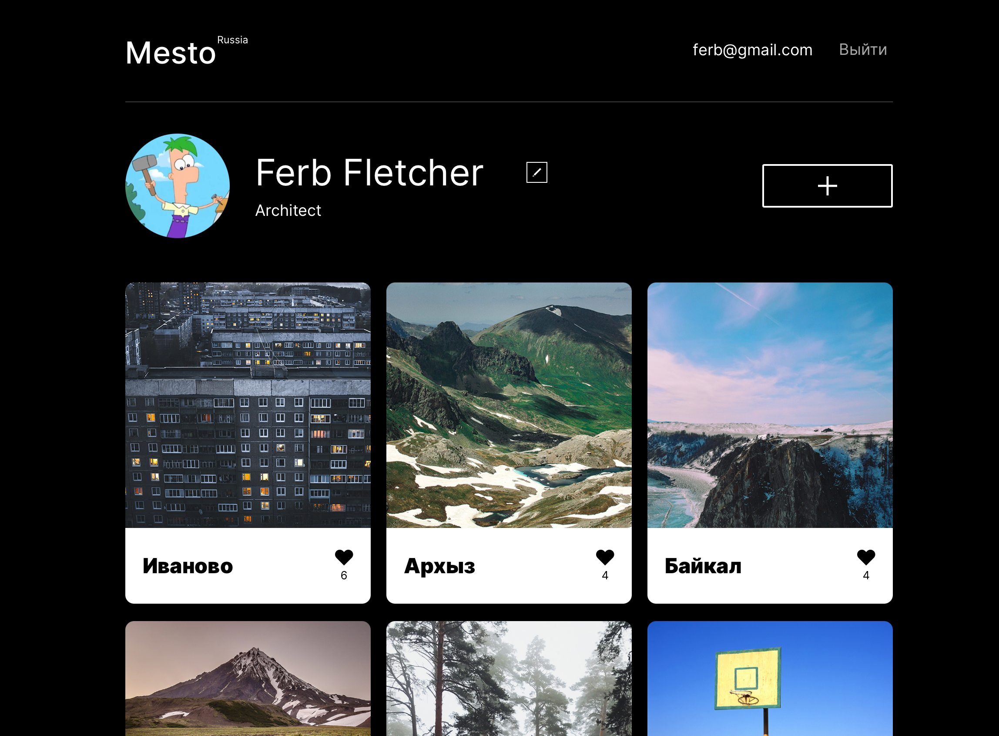

# Социальная сеть Mesto

Mesto – это примитивная социальная сеть, где пользователи могут делиться фотографиями своих любимых мест, ставить лайки
и редактировать профиль.

В рамках этого проекта было необходимо разбить монолитный фронтенд на микрофронтенды. Решение находится в ветке
[refactor/mfe](https://github.com/rusmux-edu/ya-arch-sprint-1-project/tree/refactor/mfe).

