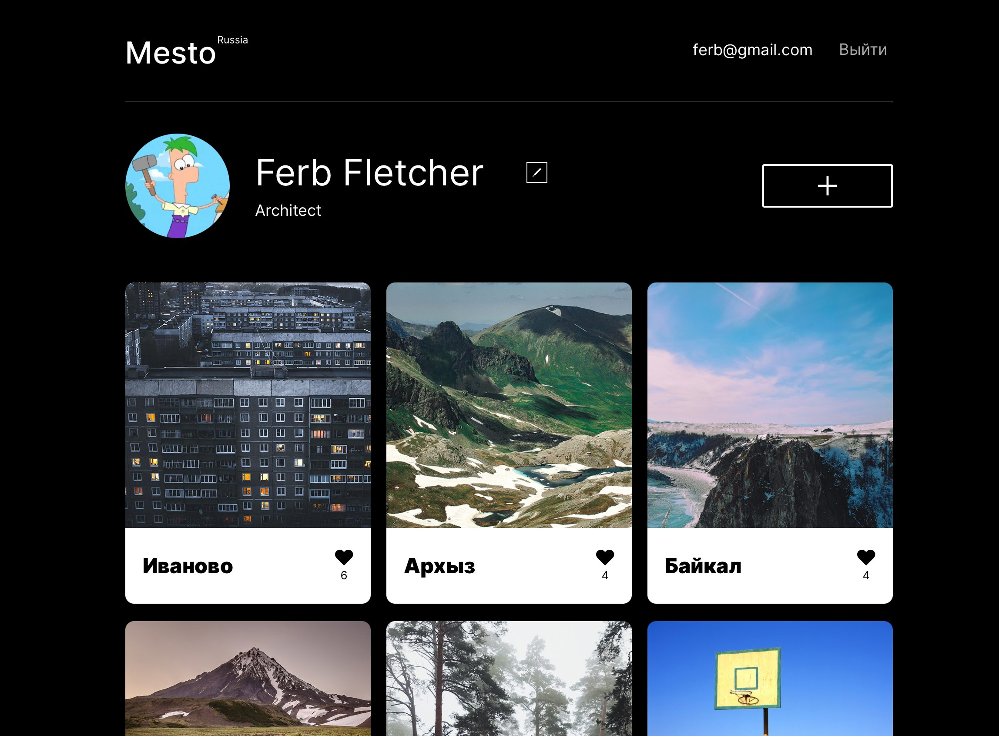

# Mesto Social Network

Mesto is a simple social network where users can share photos of their favorite places, like posts, and edit their profile.

As part of this project, the monolithic frontend needed to be split into micro frontends.

You can learn more about the frontend in the [frontend](frontend) folder.

[Task 2 – Decomposing a Monolithic Backend into Microservices](task-2).

