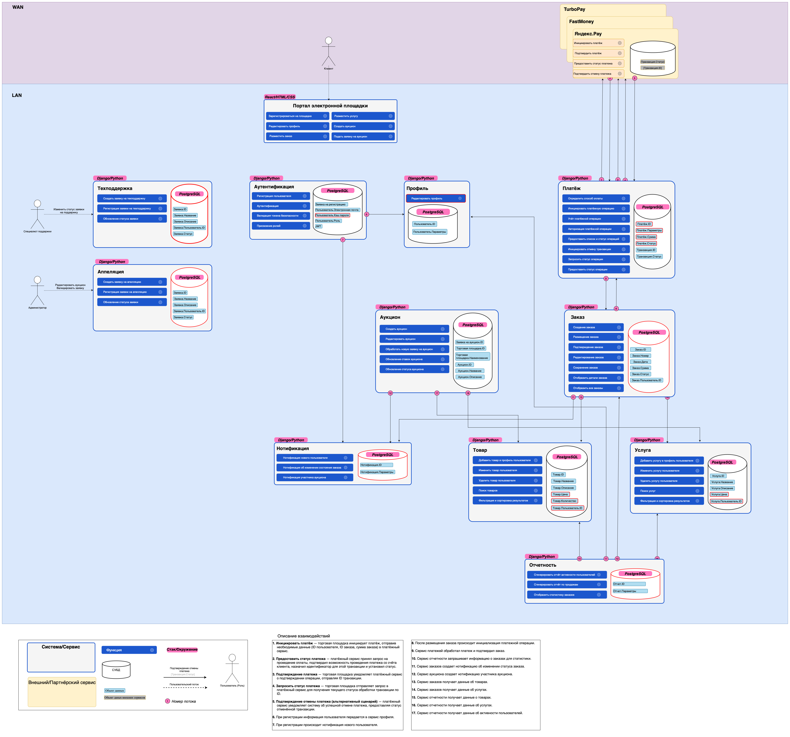

# Декомпозиция монолитного бэкенда на микросервисы

[Диаграмма](https://viewer.diagrams.net/?tags=%7B%7D&lightbox=1&highlight=0000ff&edit=_blank&layers=1&nav=1&title=task-2.drawio#Uhttps%3A%2F%2Fdrive.google.com%2Fuc%3Fid%3D1_5yk4_WBVlcXNS9rCK4sVN7Mu6VsQ-eV%26export%3Ddownload)

Были выделены следующие микросервисы, каждый микросервис имеет свою БД:

* Аутентификация – отвечает за аутентификацию и авторизацию пользователей. Потребности в сложной авторизации нет,
  поэтому объединены в один микросервис.

* Профиль – отвечает за работу с профилем пользователя.

* Товар – создание, редактирование, удаление и поиск товаров.

* Услуги – создание, редактирование, удаление и поиск услуг.

* Аукцион – создание, редактирование аукционов, управление ставками.

* Заказы – управление заказами, создание, подтверждение, отмена заказов. Собирает информацию для заказов из
  микросервисов товаров и услуг.

* Платежи – обработка платежей заказов.

* Техподдержка – обработка обращений пользователей.

* Апелляции – обработка апелляций пользователей.

* Нотификация – отвечает за отправку уведомлений пользователям. Другие микросервисы могут отправлять запросы на отправку
  уведомлений.

* Отчетность – создает отчеты по данным из других микросервисов: активность пользователя, статистика продаж и т. д.

